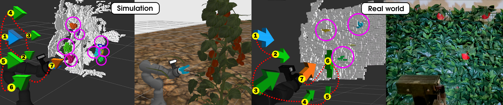

<h1 align="center">
   Active Vision and Zero-Shot Learning for Enhancing Agricultural Environment Perception
</h1>

<p align="center">
  Implementation of the research project developed during the Master's thesis of Michele Carlo La Greca at Politecnico di Milano, corresponding to the work related to the <a href="https://arxiv.org/abs/2409.12602">preprint</a> available on <i>arXiv</i>.
  <p align="center">
    
  </p>
</p>

<hr>


[![humble][humble-badge]][humble]
[![ubuntu22][ubuntu22-badge]][ubuntu22]

<!-- 
[](CONTRIBUTING.md)
[](LICENSE) -->

<hr>

## Table of contents
  * [Introduction](#introduction)
  * [Installation](#installation)
  * [Visualization](#visualization)
  * [OctoMap Creation](#octomap-creation)
  * [Active Vision](#active-vision) 

<hr>

# Introduction

Agriculture is essential to society. Robotics can boost productivity in agriculture, and robots must be able to accurately perceive the unstructured, dynamic, and possibly covered environment of plants and crops. This complexity presents significant challenges for traditional management methods. The proposed research introduces an approach to overcome the challenges and complexities of fruit perception through Active Vision (AV). Instead of relying on passive observation, AV allows robots to actively perceive, explore, and reconstruct at run-time their surroundings by planning the optimal position of the camera viewpoint using the Next-Best View (NBV) planning, which maximizes the information gained regarding plants and crops. This ensures that even hidden or occluded parts of the environment are effectively captured.

This work applies Zero-Shot Learning (ZSL) to provide useful segmentation, enabling the robot to generalize and adapt to various crops or environmental features without requiring specific training data for each scenario. By leveraging both 3D and semantic data, the robot can reconstruct a detailed, semantic, and context-aware map of the environment, allowing it to strategically adjust its movements and positioning, leading to more effective interactions with the environment.

This work focuses on the following contributions:  
1. Developed a modular architecture in ROS 2, C++, and Python for Active Vision in agricultural robotics, addressing the challenge of detecting occluded fruits.  
2. To the best of the author’s knowledge, this is the first work to integrate Zero-Shot Learning with Active Vision exploration, enabling environment-independent operation in agriculture.  
3. Conducted extensive evaluations both in simulation and real-world scenarios, in contrast to state-of-the-art methods that primarily focus on simulated environments with supervised learning.  
4. Set a benchmark standard for the lack of reproducibility and availability of open-source code in the context of Active Vision in agricultural robotics.

    

# Installation
  
<details>
  <summary>
    Step 1: Install the ROS 2 Humble distribution for Ubuntu 22.04.5 and other useful elements. 
  </summary>

   - Guide at [ROS2 Humble](https://docs.ros.org/en/humble/Installation/Ubuntu-Install-Debians.html)
     - Regarding the sourcing, instead of always running the command `source /opt/ros/humble/setup.bash`, a good practice is to add this line in the end of the *bashrc* file that can be modified with the command `gedit ~/.bashrc`. After the modification, the file needs to be saved and the terminal restarted (or `source ~/.bashrc`) 
   - Install RQt tools: `sudo apt install ros-humble-rqt*`.
   - Install dev tools: `sudo apt update && sudo apt install -y python3-vcstool`.
   - Initialize rosdep: `sudo rosdep init` and then `rosdep update`
   - Install pip: `sudo apt install python3-pip`
   - Install Gazebo Ignition Fortress:
     - A full guide is at [Gazebo Ignition Fortress](https://gazebosim.org/docs/fortress/install_ubuntu).
     - After the above installation run the command: `export IGNITION_VERSION=fortress`.
     - Install ROS 2 - Gazebo Ignition integration tools from [this repository](https://github.com/gazebosim/ros_gz/tree/humble):
       - ```bash
         sudo sh -c 'echo "deb [arch=$(dpkg --print-architecture)] http://packages.ros.org/ros2/ubuntu $(lsb_release -cs) main" > /etc/apt/sources.list.d/ros2-latest.list'
         ```
       - ```bash
         curl -s https://raw.githubusercontent.com/ros/rosdistro/master/ros.asc | sudo tee /usr/share/keyrings/ros-archive-keyring.gpg > /dev/null
         ```
       - ```bash
         sudo sh -c 'echo "deb [arch=$(dpkg --print-architecture) signed-by=/usr/share/keyrings/ros-archive-keyring.gpg] http://packages.ros.org/ros2/ubuntu $(lsb_release -cs) main" > /etc/apt/sources.list.d/ros2-latest.list'
         ```
       - ```bash
         sudo apt-get update
         ```
       - ```bash
         sudo apt install ros-humble-ros-gz
         ```
       
</details>


<details>
  <summary>
    Step 2: Setup Real Robot configuration (for Igus ReBeL and Standalone Realsense 435). 
  </summary>

   - Documentation is in progress...
       
</details>


<details>
  <summary>
    Step 3: Install the dependencies and requirements of the Igus ReBeL ROS 2 repository.
  </summary>

   - Install MoveIt2:          
     - Create a workspace (for example called `moveit2_ws`) and create a folder `src` inside
     - Add in the *bashrc* file: `source ../moveit2_ws/install/setup.bash`
     - In `moveit2_ws/src` folder clone the repository: `git clone https://github.com/michelelagreca/moveit2.git -b active_vision_config`
     - In `moveit2_ws/src` folder: `for repo in moveit2/moveit2.repos $(f="moveit2/moveit2_$ROS_DISTRO.repos"; test -r $f && echo $f); do vcs import < "$repo"; done`
     - In the same folder: `rosdep install -r --from-paths . --ignore-src --rosdistro $ROS_DISTRO -y`
     - In `moveit2_ws` folder: `MAKEFLAGS="-j4" colcon build --executor sequential --cmake-args -DCMAKE_BUILD_TYPE=Release`
     - `source ~/.bashrc`      
      
   - Install `mobile_manipulation_interfaces` package created by Simone Giampà in his [work](https://github.com/AIRLab-POLIMI/mobile-manipulation-scout-rebel):
       - `cd moveit2_ws/src`
       - `git clone --depth 1 --filter=blob:none --sparse --branch active-vision-config https://github.com/AIRLab-POLIMI/mobile-manipulation-scout-rebel.git`
       - `cd mobile-manipulation-scout-rebel`
       - `git sparse-checkout set mobile_manipulation_interfaces`
       - `cd moveit2_ws`
       - `colcon build --packages-select mobile_manipulation_interfaces`
       - `source ~/.bashrc`
         
   - Clone the `moveit2_api` package created by Simone Giampà in his [work](https://github.com/AIRLab-POLIMI/mobile-manipulation-scout-rebel): 
       - `cd moveit2_ws/src/mobile-manipulation-scout-rebel`
       - `git sparse-checkout add moveit2_api`
       - Compile this package after the compilation of workspace ros2_igus_rebel
       
   - Install MoveIt Visual Tools:
     - Go in `moveit2_ws/src` folder and clone the repository: `git clone --no-checkout https://github.com/ros-planning/moveit_visual_tools`
     - `cd moveit_visual_tools`
     - `git checkout 7c467e62cc723593a7fa557960746846b043095c`
     - `cd moveit2_ws/src`
     - `vcs import < moveit_visual_tools/moveit_visual_tools.repos`
     - `cd moveit_visual_tools`
     - `rosdep install -r --from-paths . --ignore-src --rosdistro humble -y`
     - In the folder `movit2_ws`:
       - `colcon build --packages-select rviz_visual_tools`
       - `colcon build --packages-select graph_msgs`
       - `colcon build --packages-select moveit_visual_tools` (ignore release option)
         -  If an error raises with respect to *trajectory* variable, change it manually in the source code.
     - `source ~/.bashrc`
   
   
   - Install the ROS 2 wrapper of the Realsense D435 used in the project:
     - Guide at [this repository](https://github.com/IntelRealSense/realsense-ros)
       - First, install the latest Intel® RealSense™ SDK 2.0. Use the Option 2, consisting of installing librealsense2:
       - `sudo sh -c 'echo "deb http://packages.ros.org/ros/ubuntu $(lsb_release -sc) main" > /etc/apt/sources.list.d/ros-latest.list'`
       - `sudo apt install curl # if you haven't already installed curl`
       - `curl -s https://raw.githubusercontent.com/ros/rosdistro/master/ros.asc | sudo apt-key add -`
       - `sudo apt install ros-humble-librealsense2*`
       - Install the ROS 2 wrapper: `sudo apt install ros-humble-realsense2-*`

         
   - Install the hardware interface for controlling the Gazebo Ignition robot through MoveIt2:
     - Create a workspace (for example called `gz_ros2_control`) and create a folder `src` inside
     - Add in the *bashrc* file: `source ../gz_ros2_control/install/setup.bash`
     - In `gz_ros2_control/src` folder clone the humble branch of the repository containing the hardware interface for Gazebo Ignition at a specific commit
     - `git clone --no-checkout https://github.com/ros-controls/gz_ros2_control`
     - `cd gz_ros2_control`
     - `git checkout a6ef1d6d0064a75d2df6b245820e7b1844b261af`
     - In the same folder: `rosdep install -r --from-paths . --ignore-src --rosdistro humble -y`
     - In `gz_ros2_control` folder: `colcon build`
     - `source ~/.bashrc`

   - Install ros2_control: `sudo apt install ros-$ROS_DISTRO-ros2-control`
   - Install ros2_controllers: `sudo apt install ros-$ROS_DISTRO-ros2-controllers`
   - Install tf_transformations: `sudo apt install ros-$ROS_DISTRO-tf-transformations`
  
   - Install AgileX Scout description package:
     - Create a workspace (for example called `agilex_scout`) and create a folder `src` inside
     - Add in the *bashrc* file: `source ../agilex_scout/install/setup.bash`
     - In `agilex_scout/src` folder: `git clone https://github.com/michelelagreca/scout_nav2.git`
     - In the workspace folder `agilex_scout`: `colcon build`
     - `source ~/.bashrc`
  
  
</details>


<details>
  <summary>
    Step 4: Clone the active vision branch of the <a href="https://github.com/AIRLab-POLIMI/ros2-igus-rebel">Igus ReBeL ROS 2</a> repository.
  </summary>
   
   - While the master branch is the general integration of the Igus ReBeL robotic arm into ROS 2, the active vision branch has some elements strictly related to the current project and some packages have been removed (servo, commander and gripper controller).
   - Create a workspace (for example called `ros2_igus_rebel`) and create a folder `src` inside
   - Add in the *bashrc* file: `source ../ros2_igus_rebel/install/setup.bash`
   - In `ros2_igus_rebel/src` folder run: `git clone --single-branch --branch active-vision-config https://github.com/AIRLab-POLIMI/ros2-igus-rebel.git`
   - `rosdep install -i --from-path src --rosdistro humble -y` to install the dependencies (maybe it is not needed)
   - `pip install xacro`
   - In the workspace folder run: `colcon build`
   - `source ~/.bashrc` to make effective the changes (or restart the terminal)
   - In the folder `moveit2_ws`: `colcon build --packages-select moveit2_api`
   - `source ~/.bashrc` to make effective the changes (or restart the terminal)

       
</details>


<details>
  <summary>
    Step 5: Install the dependencies of this repository.
  </summary>
   
   - Install *depth_image_proc* package:
      ```bash
       sudo apt install ros-humble-depth-image-proc*
       ```
   - Install *PCL*:
      ```bash
      sudo apt-get install ros-humble-pcl-ros
      ```
   - Install *Octomap* library:
     - Create a workspace `octomap_ws/src`
     - Source: `source ../octomap_ws/install/setup.bash`
     - In src folder: `git clone --depth 1 --branch v1.10.0 https://github.com/OctoMap/octomap.git`
     - In folder `octomap_ws`: `colcon build --cmake-arg -DCMAKE_BUILD_TYPE=Release`
     - Ignore the warnings of the deprecated functions used in the package
       <details>
         <summary>
           a warning may raise:
         </summary>
       
            ```bash
            CMake Warning at CMakeLists.txt:39 (add_library):
            Cannot generate a safe runtime search path for target moveit_visual_tools
            because there is a cycle in the constraint graph:
            ...
            
            dir 0 is [/home/michelelagreca/Documents/robotics/movit2_ws/install/graph_msgs/lib]
            dir 1 is [/home/michelelagreca/Documents/robotics/movit2_ws/install/moveit_ros_planning/lib]
            dir 2 is [/home/michelelagreca/Documents/robotics/movit2_ws/install/rviz_visual_tools/lib]
            dir 3 is [/home/michelelagreca/Documents/robotics/movit2_ws/install/moveit_ros_occupancy_map_monitor/lib]
            dir 4 is [/home/michelelagreca/Documents/robotics/movit2_ws/install/moveit_core/lib]
            dir 5 is [/opt/ros/humble/lib]
              dir 7 must precede it due to runtime library [libimage_transport.so]
            dir 6 is [/home/michelelagreca/Documents/robotics/octomap_ws/install/octomap-distribution/lib]
              dir 7 must precede it due to runtime library [liboctomap.so.1.9]
            dir 7 is [/opt/ros/humble/lib/x86_64-linux-gnu]
              dir 6 must precede it due to runtime library [liboctomap.so.1.9]
            dir 8 is [/home/michelelagreca/Documents/robotics/movit2_ws/install/moveit_msgs/lib]
            dir 9 is [/opt/ros/humble/opt/rviz_ogre_vendor/lib]
            ...
                        
            Some of these libraries may not be found correctly.
            
            CMake Warning at CMakeLists.txt:52 (add_executable):
            Cannot generate a safe runtime search path for target
            moveit_visual_tools_demo because there is a cycle in the constraint graph:
            ...
            
            dir 0 is [/home/michelelagreca/Documents/robotics/movit2_ws/build/moveit_visual_tools]
            dir 1 is [/home/michelelagreca/Documents/robotics/movit2_ws/install/graph_msgs/lib]
            dir 2 is [/home/michelelagreca/Documents/robotics/movit2_ws/install/moveit_ros_planning/lib]
            dir 3 is [/home/michelelagreca/Documents/robotics/movit2_ws/install/rviz_visual_tools/lib]
            dir 4 is [/home/michelelagreca/Documents/robotics/movit2_ws/install/moveit_ros_occupancy_map_monitor/lib]
            dir 5 is [/home/michelelagreca/Documents/robotics/movit2_ws/install/moveit_core/lib]
            dir 6 is [/opt/ros/humble/lib]
              dir 8 must precede it due to runtime library [libimage_transport.so]
            dir 7 is [/home/michelelagreca/Documents/robotics/octomap_ws/install/octomap-distribution/lib]
              dir 8 must precede it due to runtime library [liboctomap.so.1.9]
            dir 8 is [/opt/ros/humble/lib/x86_64-linux-gnu]
              dir 7 must precede it due to runtime library [liboctomap.so.1.9]
            dir 9 is [/home/michelelagreca/Documents/robotics/movit2_ws/install/moveit_msgs/lib]
            dir 10 is [/opt/ros/humble/opt/rviz_ogre_vendor/lib]
            ...
            
            Some of these libraries may not be found correctly. 
            ```
        </details>
     - `source ~/.bashrc` 
   
   - Install `Octomap_Server2`:
     - Create a workspace `octomap_server2_ws/src`
     - Source: `source ../octomap_server2_ws/install/setup.bash`
     - In the folder `octomap_server2_ws/src`: `git clone --no-checkout https://github.com/iKrishneel/octomap_server2.git`
     - `cd octomap_server2`
     - `git checkout 47c80ad46dd19976f4932247c8830eb35beeb540`
     - In the folder `octomap_server2_ws/src`: `git clone --no-checkout https://github.com/OctoMap/octomap_msgs.git`
     - `cd octomap_msgs`
     - `git checkout 50eece2bfc2f3163b2fb70b9157356e12d375dff`
     - From src folder, install dependencies: `rosdep install -r --from-paths . --ignore-src --rosdistro humble -y`
     - In folder `octomap_server2_ws`: `sudo apt-get purge --auto-remove ros-humble-octomap-msgs`
     - In folder `octomap_server2_ws`: `colcon build --symlink-install --packages-select octomap_msgs`
     - `source ~/.bashrc`
     - In folder `octomap_server2_ws`: `colcon build --symlink-install --packages-select octomap_server2`
     - Ignore warnings
     - `source ~/.bashrc`

   - Install *Lang SAM*:
     - Add `/home/.../.local/bin` to the PATH
       - Open a terminal and edit your shell configuration file (e.g., .bashrc for Bash users or .zshrc for Zsh users) with a text editor:
         ```bash
         gedit ~/.bashrc
       - Add the following line at the end of the file:
         ```bash
         export PATH="$PATH:/home/michelelagreca/.local/bin"
         ```
       - ```bash
         source ~/.bashrc
         ```
     - `pip install torch torchvision`
     - Move to `/home/michelelagreca/.local/lib/pythonX.XX/site-packages`
     - `git clone --depth 1 --filter=blob:none --sparse https://github.com/luca-medeiros/lang-segment-anything`
     - `cd lang-segment-anything`
     - `git sparse-checkout set lang_sam`
     - `git fetch origin`
     - `git checkout 134a48a81ebd691686187ecce2d016fb327a8852`
     - <details>
         <summary>
           Install dependencies:
         </summary>
       
            ```bash
            pip install addict==2.4.0 aiofiles==23.1.0 aiohttp==3.8.4 aiosignal==1.3.1 \
            altair==5.0.1 anyio==3.7.1 arrow==1.2.3 async-timeout==4.0.2 attrs==23.1.0 \
            backoff==2.2.1 beautifulsoup4==4.12.2 blessed==1.20.0 certifi==2023.5.7 \
            charset-normalizer==3.2.0 click==8.1.4 cmake==3.26.4 contourpy==1.1.0 \
            croniter==1.4.1 cycler==0.11.0 dateutils==0.6.12 deepdiff==6.3.1 \
            exceptiongroup==1.1.2 fastapi==0.100.0 ffmpy==0.3.0 filelock==3.12.2 \
            fonttools==4.41.0 frozenlist==1.4.0 fsspec==2023.6.0 gradio==3.32.0 \
            gradio-client==0.2.9 groundingdino-py==0.1.0 h11==0.14.0 httpcore==0.17.3 \
            httpx==0.24.1 huggingface-hub==0.13.4 idna==3.4 importlib-metadata==6.8.0 \
            importlib-resources==6.0.0 inquirer==3.1.3 itsdangerous==2.1.2 jinja2==3.1.2 \
            jsonschema==4.18.2 jsonschema-specifications==2023.6.1 kiwisolver==1.4.4 \
            lightning==2.0.5 lightning-cloud==0.5.37 \
            lightning-utilities==0.9.0 linkify-it-py==2.0.2 lit==16.0.6 \
            markdown-it-py==2.2.0 markupsafe==2.1.3 matplotlib==3.7.2 \
            mdit-py-plugins==0.3.3 mdurl==0.1.2 mpmath==1.3.0 multidict==6.0.4 \
            networkx==3.1 numpy==1.24.4 nvidia-cublas-cu11==11.10.3.66 \
            nvidia-cuda-cupti-cu11==11.7.101 nvidia-cuda-nvrtc-cu11==11.7.99 \
            nvidia-cuda-runtime-cu11==11.7.99 nvidia-cudnn-cu11==8.5.0.96 \
            nvidia-cufft-cu11==10.9.0.58 nvidia-curand-cu11==10.2.10.91 \
            nvidia-cusolver-cu11==11.4.0.1 nvidia-cusparse-cu11==11.7.4.91 \
            nvidia-nccl-cu11==2.14.3 nvidia-nvtx-cu11==11.7.91 opencv-python==4.8.0.74 \
            ordered-set==4.1.0 orjson==3.9.2 pandas==2.0.3 pillow==9.3.0 \
            pkgutil-resolve-name==1.3.10 platformdirs==3.8.1 pycocotools==2.0.6 \
            pydantic==1.10.11 pydub==0.25.1 pyjwt==2.7.0 pyparsing==3.0.9 \
            python-editor==1.0.4 python-multipart==0.0.6 pytorch-lightning==2.0.5 \
            pytz==2023.3 pyyaml==6.0 readchar==4.0.5 referencing==0.29.1 regex==2023.6.3 \
            requests==2.31.0 rich==13.4.2 rpds-py==0.8.10 safetensors==0.3.1 \
            segment-anything==1.0 semantic-version==2.10.0 sniffio==1.3.0 \
            soupsieve==2.4.1 spectral==0.23.1 starlette==0.27.0 starsessions==1.3.0 \
            supervision==0.6.0 sympy==1.12 timm==0.9.2 tokenizers==0.13.3 \
            tomli==2.0.1 toolz==0.12.0 torch==2.0.1 torchmetrics==1.0.0 \
            torchvision==0.15.2 tqdm==4.65.0 transformers==4.29.0 triton==2.0.0 \
            tzdata==2023.3 uc-micro-py==1.0.2 urllib3==2.0.3 uvicorn==0.22.0 \
            websocket-client==1.6.1 websockets==11.0.3 yapf==0.40.1 yarl==1.9.2 \
            zipp==3.16.1
            ```
        </details>
     - Move *lang_sam* folder up one level: `mv ~/.local/lib/python3.10/site-packages/lang-segment-anything/lang_sam/ ..`
     - At the first run of this model, sometime is required to download the models.
       
    
   - Install *YOLO World + EfficentViT SAM*:
     - Move inside the `../.local/lib/pythonX.XX/site-packages` folder
     - Into this folder: `git clone https://github.com/Curt-Park/yolo-world-with-efficientvit-sam.git`
     - `cd yolo-world-with-efficientvit-sam`
     - `git checkout 511cd0de5c8856f574ebb399f4f6f4e32410677c`
     - `pip install -r requirements.txt`
     - Move *efficientvit* folder up one level: `mv ~/.local/lib/python3.10/site-packages/yolo-world-with-efficientvit-sam/efficientvit/ ..`
     - If there are problems related to the package `pydantic`: `pip install --upgrade pydantic`
     - If there are problems related to the package `supervision`: `pip install --upgrade supervision`
     - Ignore warnings.
     - `source ~/.bashrc`

  
</details>

  
<details>
  <summary>
    Step 6: Clone the main branch of this repository.
  </summary>
   
   - Create a workspace (for example called `active_vision`) and create a folder `src` inside
   - Add in the *bashrc* file: `source ../active_vision/install/setup.bash`
   - In `active_vision/src` folder run: `git clone https://github.com/AIRLab-POLIMI/active-vision.git`
   - `cd active_vision/src/active_vision`
   - Remove the folder `images`: `rm -r images`
   - `cd active_vision/src/active_vision/av_segmentation_yolo_world/models`
   - `cat efficient_SAM_part_* > efficient_SAM_l0.pt`
   - `rm efficient_SAM_part_aa efficient_SAM_part_ab`
   - Downgrade *setuptools* (from 70.0.0 to a lower version): `python3 -m pip install setuptools==69.5.1`
   - In the workspace folder run: `colcon build --packages-select av_interfaces`
   - `source ~/.bashrc`
   - In the workspace folder run: `colcon build`
   - Ignore warnings
   - `source ~/.bashrc` to make effective the changes (or restart the terminal)
  
  
  
  
</details>


# Visualization

- ```bash
  ros2 launch igus_rebel_description_ros2 visualize.launch.py load_base:=false mount:=none end_effector:=none camera:=none moveit:=false
  ```
  - The command executes a launch file that visualize the Igus ReBeL robot on RViz2, controllable using the *Joint State Publisher* GUI.
  - The real Igus ReBeL robot can not be controlled using the *Joint State Publisher* GUI, thus the argument `hardware_protocol` should be kept `simulation` (default value).
  - It is possible to change the arguments: `load_base`, `mount`, `end_effector`, `camera`.
  - If camera is inserted, no data will be shown due to the absence of a simulated or real-word environment from which the data comes.
  - The argument `moveit` should be kept `false` to not run MoveIt2 framework for control.
 
    
<br>

- ```bash
  ros2 launch igus_rebel_description_ros2 visualize.launch.py load_base:=false mount:=none camera:=none end_effector:=none load_gazebo:=true moveit:=false
  ```
  - The command executes a launch file that run the simulation on Gazebo Ignition and visualizes the Igus ReBeL robot on RViz2, controllable using the *Joint Position Controller* GUI on Gazebo Ignition.
  - The real Igus ReBeL robot can not be controlled since Gazebo Ignition simulation is used, thus the argument `hardware_protocol` should be kept `simulation` (default value).
  - It is possible to change the arguments: `load_base`, `mount`, `end_effector`, `camera`.
  - If camera is inserted, data will be shown coming from the simulated environment. Change topics if needed.
  - The additional arguments `spawn_x`, `spawn_y`, `spawn_z`, `spawn_yaw` are used to set the position of the spawned robot on Gazebo Ignition.
  - The additional argument `env_gazebo_package` specifies the package where the gazebo world and configuration to use are located. It requires the full name of the package, otherwise it will default to this package.
  - The additional argument `full_world_name` specifies the name of the world file to be loaded in Gazebo Ignition of the type: *name.sdf*.
  - The argument `moveit` should be kept `false` to not run MoveIt2 framework for control.
  - The argument `load_gazebo` must be `true` to run the simulation.

<br>


- ```bash
  ros2 launch igus_rebel_moveit_config demo.launch.py load_base:=false mount:=none camera:=none end_effector:=none
  ```
  - The command executes a launch file that run the Igus ReBeL robot on RViz2, controllable using the MoveIt2 framework directly from RViz2.
  - The real Igus ReBeL robot can be controlled using the MoveIt2 framework commands by changing the arguments to `hardware_protocol:=cri load_base:=true`.
  - It is possible to change the arguments: `load_base`, `mount`, `end_effector`, `camera`.
  - If camera is inserted, no data will be shown due to the absence of a simulated or real-word environment from which the data comes.
  - When running MoveIt2 with a mount and a end effector that is not of that mount and a camera, there is the collision fixed of the camera link. EG v2, realsense and toucher dont enable collision of the camera link. Not a big problem.


<br>

- ```bash
  ros2 launch igus_rebel_moveit_config demo.launch.py load_base:=false mount:=none camera:=none end_effector:=none load_gazebo:=true hardware_protocol:=ignition
  ```
  - The command executes a launch file that run the simulation on Gazebo Ignition and visualizes the Igus ReBeL robot on RViz2, controllable using the the MoveIt2 framework directly from RViz2.
  - The real Igus ReBeL robot can not be controlled since Gazebo Ignition simulation is used, thus the argument `hardware_protocol` should be kept `simulation` (default value).
  - It is possible to change the arguments: `load_base`, `mount`, `end_effector`, `camera`.
  - If camera is inserted, data will be shown coming from the simulated environment. Change topics if needed.
  - The additional arguments `spawn_x`, `spawn_y`, `spawn_z`, `spawn_yaw` are used to set the position of the spawned robot on Gazebo Ignition.
  - The additional argument `env_gazebo_package` specifies the package where the gazebo world and configuration to use are located. It requires the full name of the package, otherwise it will default to this package.
  - The additional argument `full_world_name` specifies the name of the world file to be loaded in Gazebo Ignition of the type: *name.sdf*.
  - The argument `hardware_protocol` must be kept `ignition`.
  - The argument `load_gazebo` must be `true` to run the simulation.


# OctoMap Creation

The first functionality of the architecture is to create and continuously update the occupancy and semantic OctoMap starting from the input data. A decentralized approach is used, based on topic communication between the nodes responsible for various functionalities, such as segmentation, point cloud creation, and OctoMap creation. The execution of these nodes is initiated from a ROS 2 launch file and spun indefinitely until a termination command is run. The methodology is based on four nodes communicating through topics: the sensors node, the segmentation node, the point cloud node, and the OctoMap node.
<br>

- For what concerns the `octomap_normal.launch.py`, the command to execute it is:
  <br>

  ```bash
    ros2 launch av_bringup octomap_normal.launch.py run_robot:=true run_rviz:=true run_pt:=true run_octomap:=true
  ```
    - The occupancy octomap is created and updated.
    - Several parameters can be changed in the yaml configuration file ``.
    - The additional arguments `spawn_x`, `spawn_y`, `spawn_z`, `spawn_yaw` are used to set the position of the spawned robot on Gazebo Ignition.
    - Add the extra arguments `load_gazebo:=false test_camera:=true` to start only the realsense and the data streaming.
    - Add the extra arguments `load_gazebo:=false hardware_protocol:=cri moveit:=true` to start the real Igus ReBeL robot and the data streaming.
    - Set `load_base`, `mount`, `camera`, `end_effector` arguments as preferred. In particular with `load_base:=true`, add also the parameter `pointcloud_min_z:=-0.28` in the yaml file.
  <br>

    - Example command to execute the OctoMap creation functionality starting from the data coming from the camera mounted on the simulated Igus ReBeL in Gazebo Ignition:
      <br>

      ```bash
      ros2 launch av_bringup octomap_normal.launch.py run_robot:=true run_rviz:=true run_pt:=true run_octomap:=true load_base:=false mount:=mount_v2 camera:=realsense end_effector:=none
      ```
      - It is possible to move the robot using the *Joint Position Controller* GUI in Gazebo Ignition.
        <br>

    - Example command to execute the OctoMap creation functionality starting from the data coming from the Realsense camera runned standalone without real robot:
      <br>

      ```bash
      ros2 launch av_bringup octomap_normal.launch.py run_robot:=true run_rviz:=true run_pt:=true run_octomap:=true load_gazebo:=false test_camera:=true
      ```
      

    - Example command to execute the OctoMap creation funcionality starting from the data coming from the Realsense camera mounted on the real Igus ReBeL robot:
      <br>

      ```bash
      ros2 launch av_bringup octomap_normal.launch.py run_robot:=true run_rviz:=true run_pt:=true run_octomap:=true load_gazebo:=false hardware_protocol:=cri moveit:=true load_base:=true mount:=mount_v2 camera:=realsense end_effector:=soft_gripper
      ```
      - It is possible to move the robot using the MoveIt2 commands in RViz2.

<br>

- For what concerns the `octomap_segmentation_color_filter.launch.py`, the command to execute it is:
  <br>

  ```bash
    ros2 launch av_bringup octomap_segmentation_color_filter.launch.py run_robot:=true run_rviz:=true run_color_filter:=true run_pt:=true run_s_pt:=true run_octomap:=true
  ```

    - The occupancy octomap and the semantic OctoMap is created and updated. The semantic information comes from the color-filtering segmentation node.
    - Several parameters can be changed in the yaml configuration file ``.
    - The additional arguments `spawn_x`, `spawn_y`, `spawn_z`, `spawn_yaw` are used to set the position of the spawned robot on Gazebo Ignition.
    - Add the extra arguments `load_gazebo:=false test_camera:=true` to start only the realsense and the data streaming.
    - Add the extra arguments `load_gazebo:=false hardware_protocol:=cri moveit:=true` to start the real Igus ReBeL robot and the data streaming.
    - Set `load_base`, `mount`, `camera`, `end_effector` arguments as preferred. In particular with `load_base:=true`, add also the parameter `pointcloud_min_z:=-0.28` in the yaml file.
  <br>

    - Example command to execute the OctoMap creation functionality starting from the data coming from the camera mounted on the simulated Igus ReBeL in Gazebo Ignition:
      <br>

      ```bash
      ros2 launch av_bringup octomap_segmentation_color_filter.launch.py run_robot:=true run_rviz:=true run_color_filter:=true run_pt:=true run_s_pt:=true run_octomap:=true load_base:=false mount:=mount_v2 camera:=realsense end_effector:=soft_gripper
      ```
      - It is possible to move the robot using the *Joint Position Controller* GUI in Gazebo Ignition.
        <br>

    - Example command to execute the OctoMap creation functionality starting from the data coming from the Realsense camera runned standalone without real robot:
      <br>

      ```bash
      ros2 launch av_bringup octomap_segmentation_color_filter.launch.py run_robot:=true run_rviz:=true run_color_filter:=true run_pt:=true run_s_pt:=true run_octomap:=true load_gazebo:=false test_camera:=true
      ```

    - Example command to execute the OctoMap creation funcionality starting from the data coming from the Realsense camera mounted on the real Igus ReBeL robot:
      <br>

      ```bash
      ros2 launch av_bringup octomap_segmentation_color_filter.launch.py run_robot:=true run_rviz:=true run_color_filter:=true run_pt:=true run_s_pt:=true run_octomap:=true load_gazebo:=false hardware_protocol:=cri moveit:=true load_base:=true mount:=mount_v2 camera:=realsense end_effector:=soft_gripper
      ```
      - It is possible to move the robot using the MoveIt2 commands in RViz2.

<br>

- For what concerns the `octomap_segmentation_lang_sam.launch.py`, the command to execute it is:
  <br>

  ```bash
    ros2 launch av_bringup octomap_segmentation_lang_sam.launch.py run_robot:=true run_rviz:=true run_lang_sam:=true run_pt:=true run_s_pt:=true run_octomap:=true
  ```

    - The occupancy octomap and the semantic OctoMap is created and updated. The semantic information comes from the Lang SAM segmentation node.
    - Several parameters can be changed in the yaml configuration file ``.
    - The additional arguments `spawn_x`, `spawn_y`, `spawn_z`, `spawn_yaw` are used to set the position of the spawned robot on Gazebo Ignition.
    - Add the extra arguments `load_gazebo:=false test_camera:=true` to start only the realsense and the data streaming.
    - Add the extra arguments `load_gazebo:=false hardware_protocol:=cri moveit:=true` to start the real Igus ReBeL robot and the data streaming.
    - Set `load_base`, `mount`, `camera`, `end_effector` arguments as preferred. In particular with `load_base:=true`, add also the parameter `pointcloud_min_z:=-0.28` in the yaml file.
  <br>

    - Example command to execute the OctoMap creation functionality starting from the data coming from the camera mounted on the simulated Igus ReBeL in Gazebo Ignition:
      <br>

      ```bash
      ros2 launch av_bringup octomap_segmentation_lang_sam.launch.py run_robot:=true run_rviz:=true run_lang_sam:=true run_pt:=true run_s_pt:=true run_octomap:=true load_base:=false mount:=mount_v2 camera:=realsense end_effector:=soft_gripper spawn_x:=-1.0 spawn_yaw:=0.0 spawn_y:=3.0
      ```
      - It is possible to move the robot using the *Joint Position Controller* GUI in Gazebo Ignition.
        <br>

    - Example command to execute the OctoMap creation functionality starting from the data coming from the Realsense camera runned standalone without real robot:
      <br>

      ```bash
      ros2 launch av_bringup octomap_segmentation_lang_sam.launch.py run_robot:=true run_rviz:=true run_lang_sam:=true run_pt:=true run_s_pt:=true run_octomap:=true load_gazebo:=false test_camera:=true
      ```

    - Example command to execute the OctoMap creation funcionality starting from the data coming from the Realsense camera mounted on the real Igus ReBeL robot:
      <br>

      ```bash
      ros2 launch av_bringup octomap_segmentation_lang_sam.launch.py run_robot:=true run_rviz:=true run_lang_sam:=true run_pt:=true run_s_pt:=true run_octomap:=true load_gazebo:=false hardware_protocol:=cri moveit:=true load_base:=true mount:=mount_v2 camera:=realsense end_effector:=soft_gripper
      ```
      - It is possible to move the robot using the MoveIt2 commands in RViz2.
     
<br>

- For what concerns the `octomap_segmentation_yolo_world.launch.py`, the command to execute it is:
  <br>

  ```bash
    ros2 launch av_bringup octomap_segmentation_yolo_world.launch.py run_robot:=true run_rviz:=true run_yolo_world:=true run_pt:=true run_s_pt:=true run_octomap:=true
  ```

    - The occupancy octomap and the semantic OctoMap is created and updated. The semantic information comes from the YOLO World + EfficientViT SAM segmentation node.
    - Several parameters can be changed in the yaml configuration file ``.
    - The additional arguments `spawn_x`, `spawn_y`, `spawn_z`, `spawn_yaw` are used to set the position of the spawned robot on Gazebo Ignition.
    - Add the extra arguments `load_gazebo:=false test_camera:=true` to start only the realsense and the data streaming.
    - Add the extra arguments `load_gazebo:=false hardware_protocol:=cri moveit:=true` to start the real Igus ReBeL robot and the data streaming.
    - Set `load_base`, `mount`, `camera`, `end_effector` arguments as preferred. In particular with `load_base:=true`, add also the parameter `pointcloud_min_z:=-0.28` in the yaml file.
  <br>

    - Example command to execute the OctoMap creation functionality starting from the data coming from the camera mounted on the simulated Igus ReBeL in Gazebo Ignition:
      <br>

      ```bash
      ros2 launch av_bringup octomap_segmentation_yolo_world.launch.py run_robot:=true run_rviz:=true run_yolo_world:=true run_pt:=true run_s_pt:=true run_octomap:=true load_base:=false mount:=mount_v2 camera:=realsense end_effector:=soft_gripper spawn_x:=-1.0 spawn_yaw:=0.0 spawn_y:=3.0
      ```
      - It is possible to move the robot using the *Joint Position Controller* GUI in Gazebo Ignition.
        <br>

    - Example command to execute the OctoMap creation functionality starting from the data coming from the Realsense camera runned standalone without real robot:
      <br>

      ```bash
      ros2 launch av_bringup octomap_segmentation_yolo_world.launch.py run_robot:=true run_rviz:=true run_yolo_world:=true run_pt:=true run_s_pt:=true run_octomap:=true load_gazebo:=false test_camera:=true
      ```

    - Example command to execute the OctoMap creation funcionality starting from the data coming from the Realsense camera mounted on the real Igus ReBeL robot:
      <br>

      ```bash
      ros2 launch av_bringup octomap_segmentation_yolo_world.launch.py run_robot:=true run_rviz:=true run_yolo_world:=true run_pt:=true run_s_pt:=true run_octomap:=true load_gazebo:=false hardware_protocol:=cri moveit:=true load_base:=true mount:=mount_v2 camera:=realsense end_effector:=soft_gripper
      ```
      - It is possible to move the robot using the MoveIt2 commands in RViz2.

<br>


# Active Vision

The main functionality of the architecture is performing Active Vision for creating a 3D reconstruction of the agricultural environment using a centralized approach. Different from the decentralized approach,
it combines all the functionalities related to the Active Vision into a single node using multi-threading. Regarding the *Active Vision Pipeline Block*, a MultiThreadedExecutor defined in the main node is
used to allow multiple nodes to run in separate threads: *MoveIt2APICreator*, *SegmentationClient*, *PointcloudCreator*, *SegmentedPointcloudCreator*, *ExtendedOctomapCreator*, and *Pipeline*. For what concerns the *Segmentation Block*, an independent client-server node is employed, managed by using a ROS 2 service. Finally, the *Robot Block* consists of executing all the entities related to the Igus ReBeL robot. 

## Simulation (Without mobile base)

- To perform 3D reconstruction using the predefined planning:
   - Run the segmentation server: `ros2 launch av_bringup active_vision_predefined_planning_pipeline.launch.py run_yolo_world:=true`;
   - Run the Igus ReBeL robot block: `ros2 launch av_bringup active_vision_predefined_planning_pipeline.launch.py run_robot_moveit:=true spawn_x:=-0.7 spawn_y:=3.0 spawn_yaw:=0.0`;
   - Run the active vision pipeline with predefined planning: `ros2 launch av_bringup active_vision_predefined_planning_pipeline.launch.py run_active_vision_pipeline:=true`.
<br>

- To perform 3D reconstruction using the NBV planning:
   - Run the segmentation server: `ros2 launch av_bringup active_vision_nbv_planning_pipeline.launch.py run_yolo_world:=true`;
   - Run the Igus ReBeL robot block: `ros2 launch av_bringup active_vision_nbv_planning_pipeline.launch.py run_robot_moveit:=true spawn_x:=-0.7 spawn_y:=3.0 spawn_yaw:=0.0`;
   - Run the active vision pipeline with NBV planning: `ros2 launch av_bringup active_vision_nbv_planning_pipeline.launch.py run_active_vision_pipeline:=true`.


## Real-World (With mobile base)

- To perform 3D reconstruction using the predefined planning:
   - Run the segmentation server: `ros2 launch av_bringup active_vision_predefined_planning_pipeline.launch.py run_yolo_world:=true`;
   - Run the Igus ReBeL robot block: `ros2 launch av_bringup active_vision_predefined_planning_pipeline.launch.py run_robot_moveit:=true load_base:=true hardware_protocol:=cri load_gazebo:=false`;
   - Run the active vision pipeline with predefined planning: `ros2 launch av_bringup active_vision_predefined_planning_pipeline.launch.py run_active_vision_pipeline:=true load_base:=true hardware_protocol:=cri load_gazebo:=false`.
<br>

- To perform 3D reconstruction using the NBV planning:
   - Run the segmentation server: `ros2 launch av_bringup active_vision_nbv_planning_pipeline.launch.py run_yolo_world:=true`;
   - Run the Igus ReBeL robot block: `ros2 launch av_bringup active_vision_nbv_planning_pipeline.launch.py run_robot_moveit:=true load_base:=true hardware_protocol:=cri load_gazebo:=false`;
   - Run the active vision pipeline with NBV planning: `ros2 launch av_bringup active_vision_nbv_planning_pipeline.launch.py run_active_vision_pipeline:=true load_base:=true load_gazebo:=false hardware_protocol:=cri`.


[rolling-badge]: https://img.shields.io/badge/-ROLLING-orange?style=flat-square&logo=ros
[rolling]: https://docs.ros.org/en/rolling/index.html
[foxy-badge]: https://img.shields.io/badge/-foxy-orange?style=flat-square&logo=ros
[foxy]: https://docs.ros.org/en/foxy/index.html
[humble-badge]: https://img.shields.io/badge/-HUMBLE-orange?style=flat-square&logo=ros
[humble]: https://docs.ros.org/en/humble/index.html
[iron-badge]: https://img.shields.io/badge/-IRON-orange?style=flat-square&logo=ros
[iron]: https://docs.ros.org/en/iron/index.html
[ubuntu22-badge]: https://img.shields.io/badge/-UBUNTU%2022%2E04-blue?style=flat-square&logo=ubuntu&logoColor=white
[ubuntu22]: https://releases.ubuntu.com/jammy/
[ubuntu20-badge]: https://img.shields.io/badge/-UBUNTU%2020%2E04-blue?style=flat-square&logo=ubuntu&logoColor=white
[ubuntu20]: https://releases.ubuntu.com/focal/
